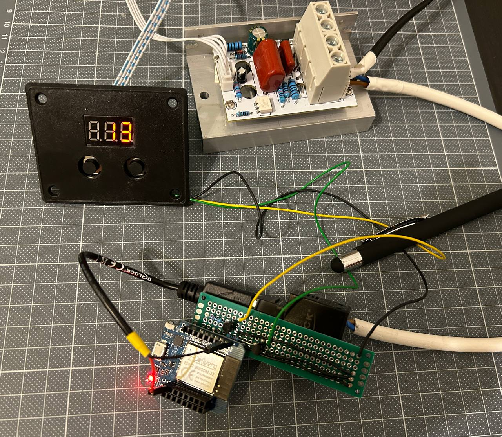

# Phase Control

Enhance a [phase control board](https://www.amazon.de/dp/B07SFF9VC6?ref_=cm_sw_r_apan_dp_5E5BYS5TRJ6GNMP8MNYR&language=de-DE) by integrating it with an ESP32 microcontroller, enabling control through a web interface. Additionally, incorporate an API to facilitate seamless integration with home automation systems.

> [!IMPORTANT]
> This project is merely a proof of concept and should not be considered as a prototype or a finished product. It is intended to demonstrate the potential capabilities and is not designed for practical use. If you choose to replicate or build upon this project, do so with caution and at your own risk.

See [Disclaimer](#disclaimer) and [Warning](#warning)




## How it works
If no wifi is configured, the ESP opens a Wifi with `ESPUI-<chipId>`. Connect to the wifi and open the webinterface at [http://192.168.0.1](http://192.168.0.1). If you want to change the wifi:
- Tab: Wifi Setting
- Enter your ssid and passwort
- Click "Save and Restart"

On successfull startup, the ESP enters `recalibration mode`, which means it is pressing the button down button for 15 sec.

## API Endpoints

### GET /api/current-value

This endpoint retrieves the current value of the phase control.

**Request:** This endpoint does not require any parameters.

**Response:**  If the request is successful, the server will respond with a `200 OK` status and an integer in the body.

### GET /api/target-value

This endpoint retrieves the target value which the phase control is moving the current value to.

**Request:** This endpoint does not require any parameters.

**Response:**  If the request is successful, the server will respond with a `200 OK` status and an integer in the body.

### GET /api/target-value?set=\<int\>

This endpoint sets the target value.

**Request:** This endpoint requires `set` as GET parameter with type `<int>`.

**Response 200:**  If the request is successful, the server will respond with a `200 OK` status and an integer in the body. The return value will be the target value of the phase control.

### POST /api/target-value

This endpoint sets the target value.

#### Request

**Request:** The request body should be a JSON object with the following properties:

- `value` (number): The target value to set.

Example:

```json
{
    "value": 42
}
```

**Response 200:**  If the request is successful, the server will respond with a `200 OK` status and an integer in the body. The return value will be the target value of the phase control.

**Response 400:**  If the parameters of the request are not correct, the server will respond with a `400 BAD REQUEST` status and an integer in the body. The return value will be `-1`.

### Stuff

- **Roadmap:** [Link to Roadmap](docs/roadmap.md)
- **Hardware Notes:** [Link to Hardware Notes](docs/hardware.md)
- **Software Development Notes:** [Link to Software Development Notes](docs/software.md)

## Disclaimer

> [!NOTE]
> THE SOFTWARE IS PROVIDED "AS IS", WITHOUT WARRANTY OF ANY KIND, EXPRESS OR IMPLIED, INCLUDING BUT NOT LIMITED TO THE WARRANTIES OF MERCHANTABILITY, FITNESS FOR A PARTICULAR PURPOSE AND NONINFRINGEMENT. IN NO EVENT SHALL THE AUTHORS OR COPYRIGHT HOLDERS BE LIABLE FOR ANY CLAIM, DAMAGES OR OTHER LIABILITY, WHETHER IN AN ACTION OF CONTRACT, TORT OR OTHERWISE, ARISING FROM, OUT OF OR IN CONNECTION WITH THE SOFTWARE OR THE USE OR OTHER DEALINGS IN THE SOFTWARE.

## Warning

> [!CAUTION]
> This project involves the use of a phase control board that operates at 230 Volts. This is a potentially lethal voltage. Extreme caution must be exercised when building, modifying, or operating this project. This project is not suitable for people who are not familiar with electrical safety procedures. If you're not sure about something, seek help from a qualified professional. Do not risk your life or the lives of others. Always remember: Safety first!