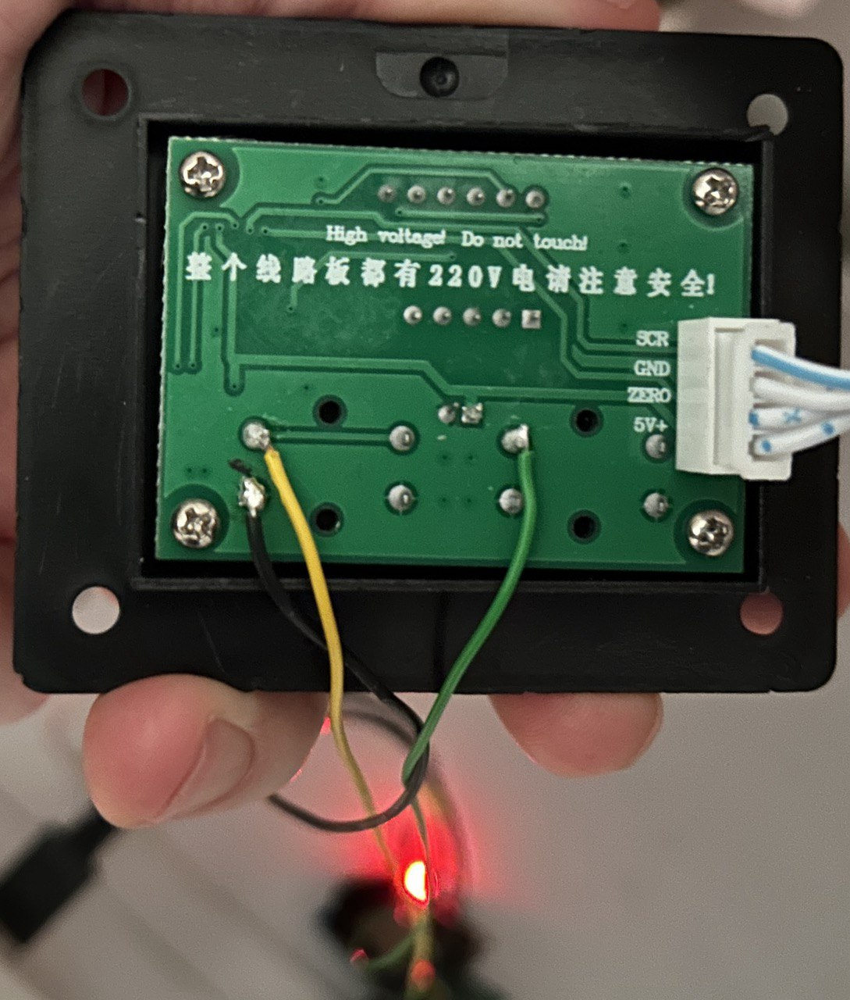

## Hardware Notes

### Hardware configuration
- ESP: D1
- PIN IO33 for Green / Down
- PIN TMS for Yellow / Up
- To set the button on GND, I used a 2n2222 NPN Transistor.

    - Collector: to the V+ of the button on the controll board.
    - Base: with an 2k2 Ohm resistor to the ESP pin.
    - Emitter to GND

- GND connected between ESP32 and the controll board
- ESP32 with external Power Supply, because the board could only deliver had 6mA

### Wireing

#### Notes
- BJT: https://www.diyengineers.com/2020/12/17/2n2222-transistor-npn/
- ESP32 Pin Max Current: Each GPIO pin is rated at 40mA for a ESP32. It is recommended that a max of 20mA per GPIO pin for best thingies
